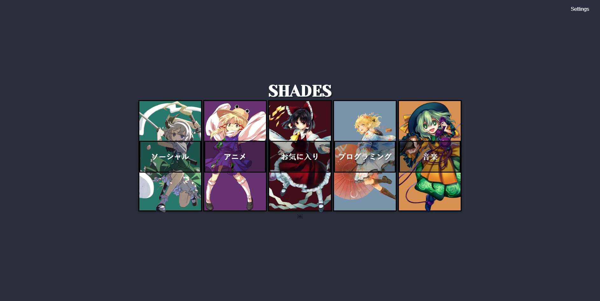
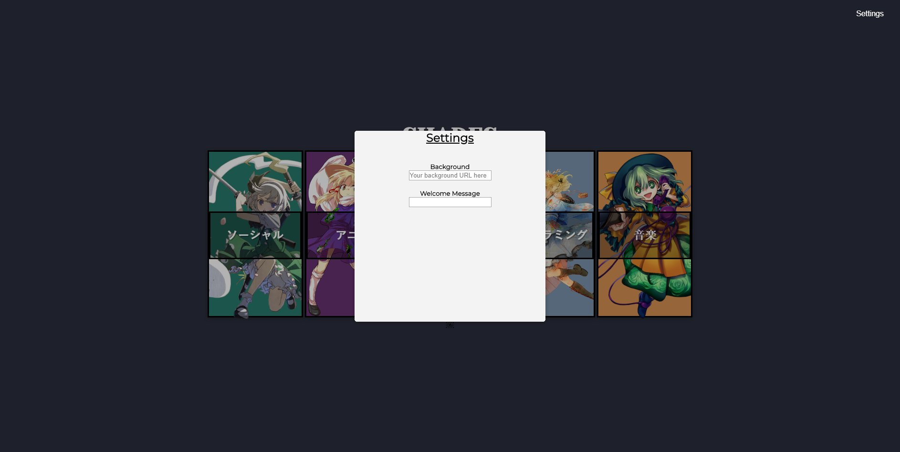

# Shades
<a href='https://lewlewonics.github.io/Shades/'>Live Version</a>
A minimal and colorful Touhou Project start page theme.



How to use
-------------------------------
<ol> 
<li> create a github account and fork this repository.</li>
<li> download <a href="https://desktop.github.com/">Github Desktop</a>, go to File/Options and Sign in with your current account.</li>
<li> go to File/Clone repository and select the one you forked (it'll be named <i>Username/Shades</i>). </li>
<li> click the <i>Current branch</i> tab and select <i>gh-pages</i>. Then go to Repository/Show in Explorer to customize the startpage. After modifying what you want, return to Github Desktop window and click the button <i>Commit to gh-pages</i> (you'll have to write a title in Summary before).</li>
<li> finally, click the button <i>Push origin</i>. After 10 minutes or less, you'll be able to go to https://username.github.io/Shades/.</li>
<li> go to your browser setting and set https://username.github.io/Shades/ as your default homepage.</li>
<li> download the add-on <i>New Tab Override</i> (<a href="https://chrome.google.com/webstore/detail/new-tab-override/fjcmlondipcnnpmbcollgifldmajfonf?hl=en-GB">Google Chrome</a> or <a href="https://addons.mozilla.org/en-US/firefox/addon/new-tab-override/">Firefox Mozilla</a>), go to options and select <i>current home page</i></li>
</ol>

Customize
-------------------------------
Open up the script.js in a text editor and begin messing with the links on the top of the document. It should be
fairly straight forward from here.

You can customize:
<ul>
  <li>Categories</li>
  <li>Links</li>
  <li>Color palette</li>
  <li>Background and Welcome Message</li>
  </ul>
  
### For Links and Colors
```javascript
/////////////////////////////////////////////////////////////////////////////////////////////////
//                                      FOR USER 
// LEFT ----> RIGHT [] [] [] [] []
//Social    
const category1_titles = ['Gmail', 'Reddit', 'Twitter', 'Youtube'];
const category1_links = [`https://mail.google.com/mail/u/0/#inbox`, `https://www.reddit.com`, `https://twitter.com`, `https://www.youtube.com`];
//Anime
const category2_titles = ['Anilist', 'Animepahe', 'Crunchyroll', 'Danbooru',];
const category2_links = [`https://anilist.co`, `https://animepahe.com`, `https://crunchyroll.com`, `https://danbooru.donmai.us/posts?tags=touhou`];
//Extras
const category3_titles = [''];
const category3_links = [``];
//School
const category4_titles = ['Github', 'Moodle', 'Webassign'];
const category4_links = [`https://github.ncsu.edu/`, `https://wolfware.ncsu.edu/courses/my-wolfware/`, `https://www.webassign.net/ncsu/`];
//Music
const category5_titles = ['Listen.moe', 'Spotify'];
const category5_links = [`https://listen.moe`, `https://open.spotify.com/`];
//In order of left -> right
const categories = ['ソーシャル','アニメ','エクストラ','学校','音楽'];
                                                                          //Background Color
const card_colors = ['#28796B','#693273','#410E1A', '#7A94AB', '#D79052', '#2B2F3D']
//////////////////////////////////////////////////////////////////////////////////////////////
```

### For background and welcome message


